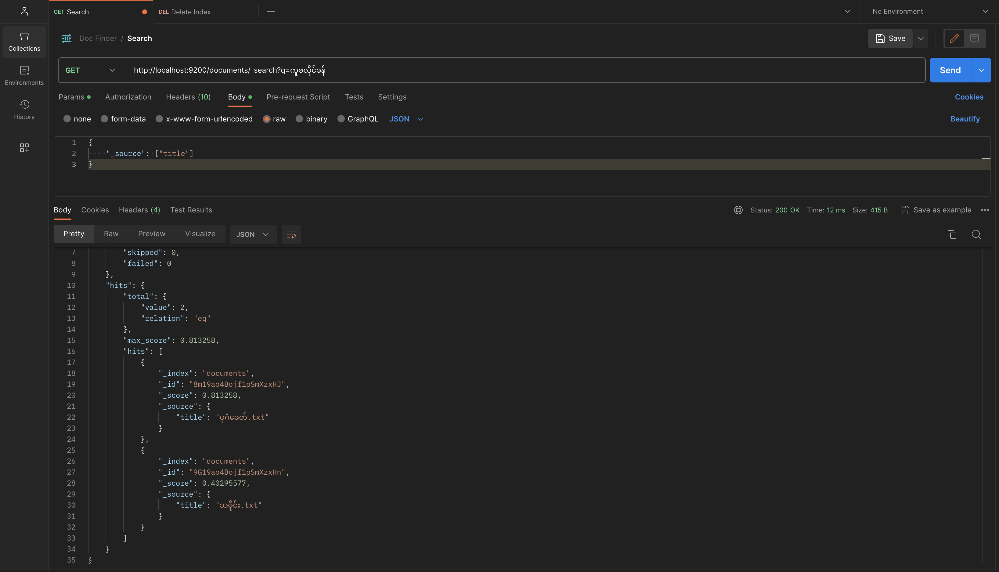

# DocFinder
Example project for search file base on file name or content. This version is only work for txt file format. 



## Setup
Install Elasticsearch with Docker  
```
docker-compose up
```

## Quite Start
create file index using the following command
```
npm start
```

import postman.json file and search


## Elasticsearch curl
```
curl -XGET 'http://localhost:9200/documents/_mapping'
```

```
curl -XGET 'http://localhost:9200/documents/_search?q=team'
```

Search and only return title fields
```
curl -XGET 'http://localhost:9200/documents/_search?q=team&_source=tit‌​le'
```